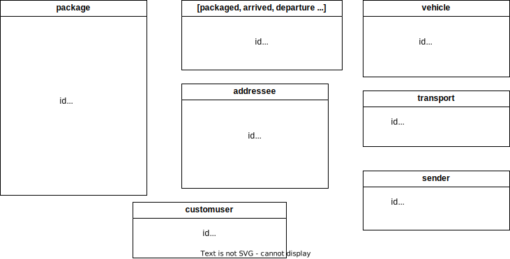

# SAE302

## Description

Ce mini-projet consiste à créer une application pour la gestion de colis. Les technologies utilisées sont Django et sqlite3.


## Conditions

L'utilisateur administrateur peut réaliser toutes les opérations. Il crée, modifie et supprime notamment les expéditeurs

L'expéditeur crée des colis des destinataires ainsi que les transporteurs.

Le transporteur créer des livraisons avec les colis qu'il doit livrer. Les livraisons sont associés à des véhicule. A chaque étape, il renseigne la localisation et le temps des étapes du colis.

Le destinataire peut consulter les colis qui lui sont destinés et affirmer si il les a reçu ou non. On part du principe que le destinataire reçoit un mail avec ses identifiants pour se connecter au site. Il n'y a donc pas d'inscription.

## Structure

Le dossier src est l'ensemble du site web. Le tableau prend forme mais certaines étapes cruciales demandent encore notre attention pour parfaire notre réalisation. 
Nous avons structuré le site en 2 applications: l'authentification et puis le principal. L'authenficiation a été modifié et se fait avec un email et un mot de passe. 

## Installation

Il existe un dépot git:

```
https://github.com/Jonathan-Schlegel/SAE302
```

Pour lancer le serveur web de zéro, il faut se placer dans le dossier src et vérifier que le fichier db.sqlite3 n'existe pas. Sinon il faut le supprimer. Il est nécessaire d'initialiser la base de données. Bien sur, il est nécessaire d'installer le paquet Django. On crée la structure:

```python
python3 manage.py makemigrations
```

Puis on l'applique:

```python
python3 manage.py migrate
```

 Ensuite, il nous définissons le super-administrateur avec la commande suivante:

```python
python3 manage.py createsuperuser --email admin@admin.fr
```

Vous pouvez renseigner le mot de passe. Nous choisissons "admin" comme mot de passe.

```python
python3 manage.py runserver 3456
```

## Commentaires

A la racine du dossier SAE302, se trouve le fichier django.md. Il retrace tous ce que nous avons compris et appris sur Django à quelques détails près.

Voici le schéma de la base de données:



Il est disponible sous le nom schema_bdd.drawio.

Nous pouvons observer le contenu de la base de données grâce à l'extension sqlite viewer sur visual studio code. La table authentication_customuser contient les informations sur les utilisateurs. Étonnament, lorsque l'on crée un utilisateur via l'interface d'administration, il semble que la création d'un utilisateur ne se fasse correctement. Le mot de passe n'est pas hasher. L'application n'est pas aboutie. Les utilisateurs ne peuvent pas lister et modifier et supprimer les colis. La partie "Transporteur" n'a presque pas été développée. Tous les cas n'ont pas été pris en compte. De plus, une fois connecté, un utilisateur peut accéder à toutes les urls comme la page de l'expéditeur, du destinataire et du transporteur. Le système de journalisation n'est aussi pas aboutie car seul les connexions sont enregistrées. Il faudrait enregistrer les actions de l'utilisateur.


