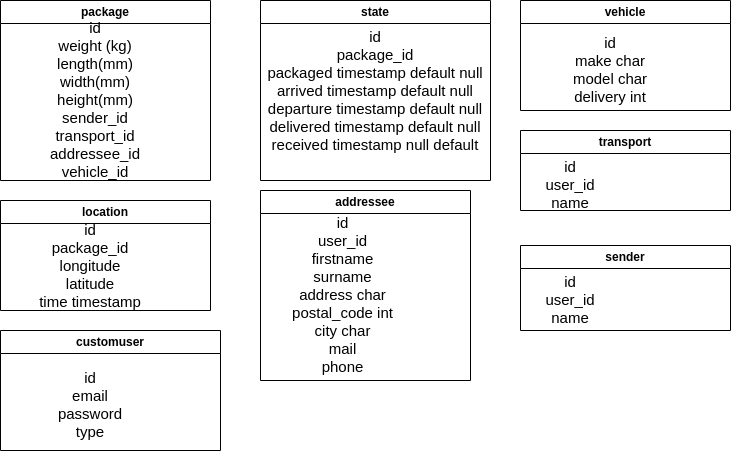
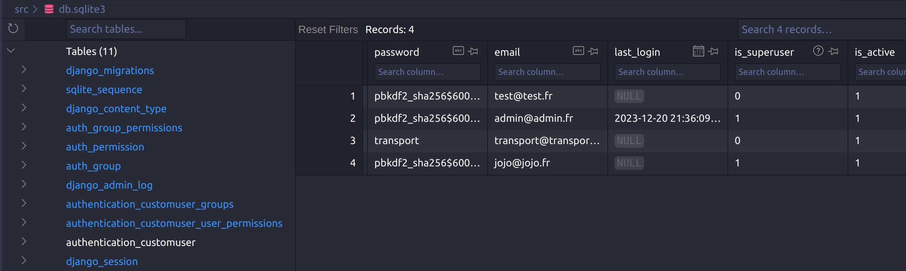

# SAE302

## Description

Ce mini-projet consiste à créer un site web pour la gestion de colis. Les technologies utilisées sont Django et sqlite3.


## Conditions

L'utilisateur administrateur peut réaliser toutes les opérations. Il crée, modifie et supprime notamment les expéditeurs et les transporteurs.

L'expéditeur crée des colis et des destinataires. C'est lui qui renseigne toute les informations sur le colis qu'il peut ainsi que sur le destinataire.

Le transporteur créer des livraisons avec les colis qu'il doit livrer. Les livraisons sont associés à des véhicule. A chaque étape, il actualise la localisation des colis.

Le destinataire peut consulter les colis qui lui sont destinés et affirmer si il les a reçu ou non. On part du principe que le destinataire reçoit un mail avec ses identifiants pour se connecter au site. Il n'y a donc pas d'inscription.

## Structure

Le dossier src est l'ensemble du site web. Le tableau prend forme mais certaines étapes cruciales demandent encore notre attention pour parfaire notre réalisation. 
Nous avons structuré le site en 2 applications: l'authentification et puis le principal. L'authenficiation a été modifié et se fait avec un email et un mot de passe. 

## Installation

Il existe un dépot git:

```
https://github.com/Jonathan-Schlegel/SAE302
```


Pour lancer le serveur web de zéro, il faut se placer dans le dossier src et vérifier que le fichier db.sqlite3 n'existe pas. Sinon il faut le supprimer. Il est nécessaire d'initialiser la base de données. Bien sur, il est nécessaire d'installer le paquet Django. On crée la structure:

```python
python3 manage.py makemigrations
```

Puis on l'applique:

```python
python3 manage.py migrate
```

 Ensuite, il nous définissons le super-administrateur avec la commande suivante:

```python
python3 manage.py createsuperuser --email admin@admin.fr
```

Vous pouvez renseigner le mot de passe. Nous choisissons "admin" comme mot de passe.

```python
python3 manage.py runserver 3456
```

##  Fonctionnalités 

Vous pouvez vous connecter à l'adresse http://localhost:3456/admin pour accéder à l'interface d'administration. A partir de là, vous pouvez créer un utilisateur dans "modifier" de la section "customuser". Il faut y renseigner un email, un mot de passe ainsi que le type d'utilisateur. C'est-à-dire "addressee", "sender" ou "transport".
Pour tester l'authentification des utilisateurs, il faut se connecter à l'adresse http://localhost:3456/login. Vous pouvez vous connecter avec les identifiants que vous avez créé. Vous serez redirigé vers la page qui concerne l'utilisateur. La déconnexion ne fonctionne pas.


## Commentaires

A la racine du dossier SAE302, se trouve le fichier django.md. Il retrace tous ce que nous avons compris et appris sur Django à quelques détails près.

Voici le schéma toujours imcomplete de la base de données:



Il est disponible sous le nom schema_bdd.drawio.

Nous pouvons observer le contenu de la base de données grâce à l'extension sqlite viewer sur visual studio code. La table authentication_customuser contient les informations sur les utilisateurs. Étonnament, lorsque l'on crée un utilisateur via l'interface d'administration, il semble que le mot de passe ne soit pas hasher:




